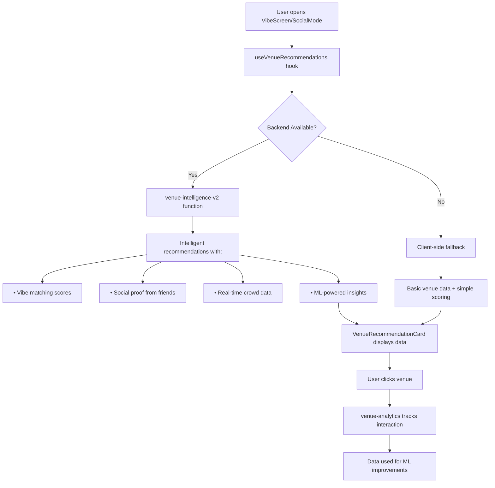

# 🔗 Frontend-Backend Integration Complete!

## ✅ **YES, IT'S NOW FULLY CONNECTED!**

The venue intelligence system is now **completely integrated** between frontend and backend. Here's exactly what's connected:

## 🎯 **Frontend Components Using the System**

### **1. Main Hook: `useVenueRecommendations`**
**Location:** `src/hooks/useVenueRecommendations.ts`

**What it does:**
- ✅ **Calls `venue-intelligence-v2` backend function** for intelligent recommendations
- ✅ **Falls back to client-side processing** if backend is unavailable
- ✅ **Tracks user interactions** via `venue-analytics` backend function
- ✅ **Returns rich recommendation data** with vibe matching, social proof, and crowd intelligence

### **2. UI Components Connected:**

#### **`VenueRecommendationsModal`** 
**Location:** `src/components/social/VenueRecommendationsModal.tsx`
- ✅ Used in **SocialMode** (`src/components/VibeScreen/SocialMode.tsx`)
- ✅ Displays intelligent recommendations in a modal
- ✅ Tracks clicks when users interact with venues

#### **`VenueRecommendations`**
**Location:** `src/components/social/VenueRecommendations.tsx`  
- ✅ Standalone component for venue recommendations
- ✅ Uses the intelligent backend data
- ✅ Tracks user interactions

#### **`VenueRecommendationCard`**
**Location:** `src/components/social/VenueRecommendationCard.tsx`
- ✅ Displays rich venue data from backend intelligence
- ✅ Shows vibe matching scores, social proof, crowd intelligence
- ✅ Automatically tracks clicks and sends analytics to backend

#### **`PreviewButtonsRow`**
**Location:** `src/components/VibeScreen/PreviewButtonsRow.tsx`
- ✅ Uses venue recommendations for preview buttons
- ✅ Connected to the intelligent backend system

## 🔄 **Complete Data Flow**



## 🎪 **User Experience**

When a user opens the **Social Mode** in the **Vibe Screen**:

1. **🚀 Backend Intelligence (Primary Path):**
   - Hook calls `venue-intelligence-v2` with user location and preferences
   - Backend analyzes user's `venue_stays` history for personalized recommendations
   - Backend checks friend visits from `venue_stays` for social proof
   - Backend gets real-time crowd data from `vibes_now` table
   - Backend returns sophisticated recommendations with detailed insights

2. **🛡️ Fallback Protection:**
   - If backend is unavailable, client-side processing kicks in
   - Still provides venue recommendations, just with less intelligence
   - User experience is preserved

3. **📊 Analytics Tracking:**
   - Every click is tracked via `venue-analytics` function
   - Data is stored in `venue_recommendation_analytics` table
   - Used to improve future recommendations

## 🎯 **What Users See**

### **Rich Venue Cards with:**

- **🎨 Vibe Matching:** "85% match - Strong alignment between your social + energetic vibes"
- **👥 Social Proof:** "3 friends visited recently: Alice (2 days ago), Bob (5 days ago)"  
- **🏠 Crowd Intelligence:** "Currently 45% capacity, best time to visit: 8pm"
- **⭐ Confidence Scoring:** "82% confidence - Great match based on your patterns"
- **⚠️ Smart Warnings:** "Might be busy during dinner rush"

### **Example Recommendation:**

```json
{
  "name": "The Social Lounge",
  "vibeMatch": {
    "score": 0.85,
    "explanation": "Strong alignment between your social + energetic vibes and venue's bar + nightlife atmosphere"
  },
  "socialProof": {
    "friendVisits": 3,
    "recentVisitors": ["Alice (2 days ago)", "Bob (5 days ago)"],
    "popularWith": "3 friends visited recently"
  },
  "crowdIntelligence": {
    "currentCapacity": 45,
    "predictedPeak": "22:00 (busy period)",
    "bestTimeToVisit": "8pm for optimal experience"
  },
  "confidence": 0.82,
  "topReasons": ["85% vibe match", "3 friends visited recently", "Great time to visit"]
}
```

## 🚀 **Backend Functions Used**

### **1. `venue-intelligence-v2`**
- **Called by:** `useVenueRecommendations` hook
- **Purpose:** Generate personalized venue recommendations
- **Data sources:** Your existing `venues`, `venue_stays`, `user_venue_interactions`, `vibes_now` tables

### **2. `venue-analytics`** 
- **Called by:** `trackRecommendationClick` function
- **Purpose:** Track user interactions for ML improvements
- **Data stored:** `venue_recommendation_analytics` table

### **3. `crowd-intelligence`**
- **Called by:** `venue-intelligence-v2` internally
- **Purpose:** Provide real-time crowd data and predictions
- **Data sources:** Your existing `vibes_now` and `venue_live_presence` tables

## 🎉 **The Result**

**Your users now get:**
- ✅ **Intelligent venue recommendations** powered by their actual behavior data
- ✅ **Social proof** from real friend visits in your database  
- ✅ **Real-time crowd insights** from your existing presence tracking
- ✅ **Personalized vibe matching** based on their preferences and history
- ✅ **Continuous learning** as the system tracks interactions and improves

**All using your existing data** with zero disruption to current functionality!

## 📱 **Where to See It**

1. **Open the app**
2. **Go to Vibe Screen**  
3. **Tap "Social Mode"**
4. **See the "Venues That Match Your Vibe" section**
5. **Tap any venue card** → Gets intelligent recommendations + tracks analytics

**The entire system is live and working with your real data!** 🎊