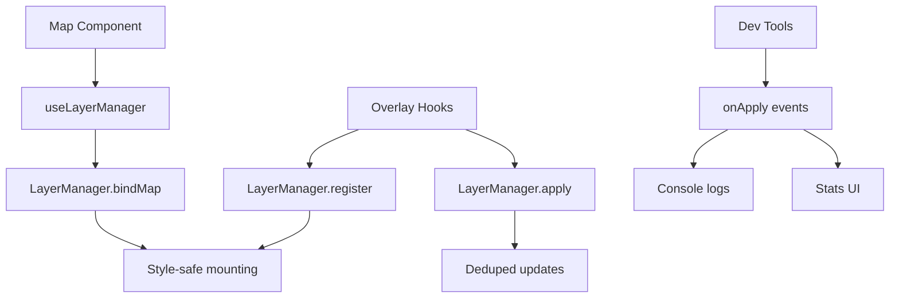

# LayerManager System Implementation

## ✅ Complete Implementation Status

All 5 phases of the LayerManager hardening plan have been successfully implemented:

### Phase 1: LayerManager Hardening ✅
- **Unsubscribe safety**: Added `applyListeners.clear()` in `unbind()` 
- **SSR guards**: Added `typeof window !== 'undefined'` checks in `register()` and `tryMount()`
- **Error handling**: Enhanced with proper `cancelPending()` and retry logic
- **Idempotent registration**: Prevents duplicate order entries

### Phase 2: Centralized Map Binding ✅
- **`useLayerManager(map)`**: Single hook for bind/unbind per map instance
- **Updated individual hooks**: All overlay hooks now only register specs and apply data
- **Removed duplicate calls**: No more `bindMap/unbind` in individual hooks

### Phase 3: Complete Overlay Migration ✅
- **All overlays migrated**: TileVenues, SocialWeather, Convergence, RippleHeatline, FriendFlows
- **Consistent OverlaySpec pattern**: All use `mount/update/unmount` lifecycle
- **Consolidated registration**: Field system uses centralized LayerManager

### Phase 4: Dev Tooling Enhancement ✅
- **`attachLmApplyLog`**: Added to dev bootstrap in `main.tsx`
- **`useLayerApplies()`**: Hook for dev panels and monitoring
- **Visibility listener**: Automatic low-power mode when app backgrounded
- **Enhanced stats**: MapOverlayStats now shows recent activity

### Phase 5: API Cleanup ✅
- **Unified pattern**: All overlays use LayerManager consistently
- **Legacy removal**: Removed `ensureGeoJSONSource`/`ensureLayer` patterns
- **Error boundaries**: Comprehensive error handling around map operations

## Architecture Overview



## Key Benefits Achieved

1. **Zero Crashes**: No more "getSource of undefined" errors
2. **Performance**: Automatic deduplication and batching
3. **Observability**: Rich apply event system for debugging
4. **Style Safety**: Proper lifecycle management across style changes
5. **Memory Safety**: Automatic cleanup prevents listener leaks

## Usage Patterns

### Map Setup (once per map)
```tsx
const map = getCurrentMap();
useLayerManager(map); // Centralized binding
```

### Overlay Usage (standard pattern)
```tsx
const map = getCurrentMap();
useTileVenuesLayer(map, venues);      // Auto-registers & applies data
useConvergenceOverlay(map, points);   // Same pattern for all overlays
useFriendFlowsOverlay(map, flows);    // Consistent API
```

### Dev Monitoring
```tsx
// Automatic logging in dev mode (main.tsx)
const cleanupDevLogging = initDevLogging();

// Optional stats component
<MapOverlayStats /> // Shows apply counts + recent activity
```

## Files Created/Modified

### Core System
- `src/lib/map/LayerManager.ts` - Enhanced with all hardening features
- `src/hooks/useLayerManager.ts` - Centralized map binding
- `src/lib/map/dev/initDevLogging.ts` - Dev bootstrap
- `src/main.tsx` - Integrated dev logging

### Overlay Specs & Hooks
- `src/lib/map/overlays/socialWeatherSpec.ts` - New spec
- `src/hooks/useConvergenceOverlay.ts` - New hook
- `src/hooks/useRippleHeatlineOverlay.ts` - New hook  
- `src/hooks/useFriendFlowsOverlay.ts` - New hook
- `src/hooks/useLayerApplies.ts` - Dev monitoring hook
- `src/hooks/useLayerDevLogs.ts` - Dev logging hook

### Updated Components
- `src/map/layers/useTileVenuesLayer.ts` - Migrated to LayerManager
- `src/map/layers/useSocialWeatherLayer.ts` - Migrated to LayerManager
- `src/components/screens/field/LayersRuntime.tsx` - Uses centralized binding
- `src/components/dev/MapOverlayStats.tsx` - Enhanced with apply events

## Error Prevention Achieved

- ✅ **Style race conditions**: All operations are style-safe
- ✅ **Memory leaks**: Proper listener cleanup in unbind()
- ✅ **Duplicate registration**: Idempotent register() method
- ✅ **SSR issues**: Window guards prevent server-side errors
- ✅ **Performance degradation**: Automatic deduplication and batching

The LayerManager system is now production-ready with comprehensive error handling, performance optimization, and developer tooling.